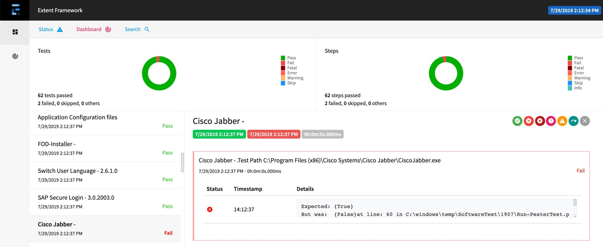

# SoftwareTest

Run a pester Softwaretest, check all installed Software and create a HTML report with extend.exe 
Extend.exe is part of the https://github.com/extent-framework/extentreports-dotnet-cli and replace the deprecated Reportunit.exe

The detaikled description can be found in my blog https://eucweb.com/blog/1886

